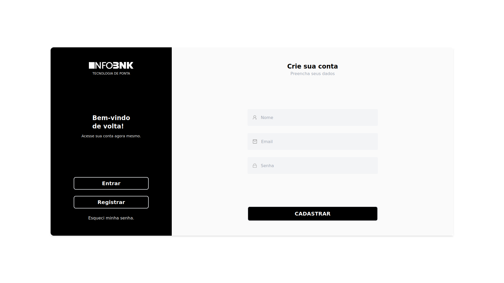
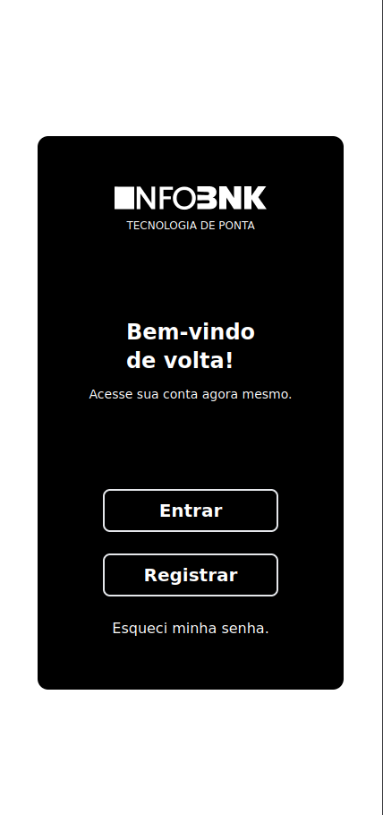

# Tela de cadastro

Bem-vindo ao Tela de cadastro, um projeto desenvolvido com objetivo de praticar.

## Tecnologias Utilizadas

- HTML
- tailwind
- JavaScript

## Funcionalidades

- **Cadastrar novos usuarios:** Pode cadastrar varios usuarios com nome e email diferentes e eles seram salvos no local storage do navegador.

- **Logar:** caso o usuario estiver correto ira levar para outra pagina.

## Como Visualizar Localmente

1. Clone o repositório:
   ```bash
   git clone https://github.com/seu-usuario/catalogo-filmes.git

2. Explore a [Tela de login](https://glistening-pasca-7fd5a1.netlify.app/) pelo deploy.

## Contato

Instagram: [otavio.code](https://www.instagram.com/otavio.code/)
LinkedIn: [Otávio-Monteiro-Barra](https://www.linkedin.com/in/ot%C3%A1vio-monteiro-barra/)

## Projeto



